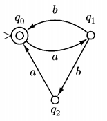
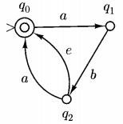

# 非确定性图灵机(Non-deterministic Finite Automata)

## 基本定义

以下两图展示了两种NFA相对于DFA的特殊性质。

* 在同一个状态同一个输入后，也可以跳转到不同的状态
* 即使输入是空，也可以跳转到不同的状态

那字符串输入图灵机后会发生什么呢，我们有两种理解方式:

* 字符串会尝试NFA中转移的每一个可能性，形成一个树状结构，在最后，只要有一种可能性落在了NFA的finial state中，即属于该NFA表达的regular language。
* 每次一个字符输入NFA，NFA总会选择最优的分支，如果该字符串输入该NFA表达的regular language，那么最终的状态一定会属于final state

容易知道以上两种表达方式是相同的。

## 公式化定义

NFA可由5个要素表达：$\{K,\sum,\Delta,s,F\}$,与DFA唯一的区别是$\Delta$:

$\Delta=K\times(\sum\cup\{e\})\times K$

与之前的区别就是$\delta$是一个函数，一对state和input只能得到一个值，而$\Delta$是一个集合，一对state和input能得到多个值，而且input可以为空。

与DFA相同有$\vdash^M的定义，此处不重复$

NFA的设计会简单很多，因为总能猜对，只要我们能保证：
* 当input属于regular language时候，总有路走对
* 当input不属于的时候，没有路能走对。

## NFA和DFA等价性

> 任意一台NFA均有和他等价的DFA

对于任意一NFA，如果我们把它的状态的集合看成一个状态，那由于每次输入一个字符，一个状态能跳转到的状态终究是属于该NFA状态的集合，所有我们可以用状态的集合组成的状态来描述NFA的跳转，此时的跳转是确定的。

