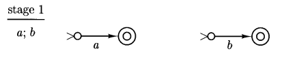
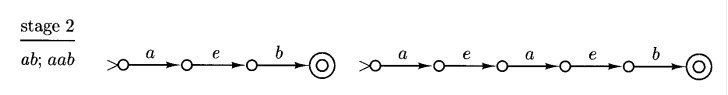

# regular language

## language操作对正则性质的影响

我们之前学习了language的拼接，重复，合并等操作，那两种regular language经过上述o操作后还能保持其正则性质吗？

因为regular language和finite automata一一对应，所以，我们只要能够构造出能够接收复合后language的finite automata,就能够证明其正则性保持不变。

### union

union与或操作类似，对于字符串$a\cup b$，$M_1$能处理a，$M_2$能处理b，我们只需要判断该字符串属于a还是b，即可以将字符串送到对应的automata中处理，而NFA刚好有“选择最优跳转路径”的特性，因此我们构造automata如下：

可发现union不改变正则性

### concatenation

拼接操作下，与上文相同，对于字符串$ab$，我们只需要在字符串a被$M_1$识别完之后跳转到$M_2$，即在$M_1$final state接条空字符串跳转到$M_2$的initial state就可以构造识别$ab$的NFA了，至于什么时候跳转，伟大的NFA会解决这一切的。

可发现concatenation不改变正则性

### Kleene star(重复)

重复字符串与拼接字符串差不多（可看成相同字符串的拼接），因此对于$a^*$，我们可以将$M_1$的final state全部接一条空字符串跳转回去initial state，即可完成。

了吗？事实上不然，因为Kleene star包括等于0的情况，而以上方法无法识别空字符串，因此我们采用如下方法，新造一个initial state，具体如下图：

可发现Kleene star不改变正则性。

!!! note
    拼接，重复和合并均不改变语言的正则性。

## regular expression 和 finite automata的互相转化

### regular expression 转 finite automata
以上三者为regular expression构造的三种常用手段基于以上三种方法，我们可以总结出通过regular expression构造finite automata的方法：
  
* 对于单个字符，直接构造,如下图：

* 对于拼接操作，直接拼接两个automata（中间加不加空字符串转移都行）

* 对于并集，加一个initial state然后空字符串分支，如下图：

* 对于Kleene star，我们进行如下操作（注意finite state的位置）:
  

基于以上操作，我们几乎可以把任何regular expression转化成finite automata了。

### finite automata 转 regular expresssion
