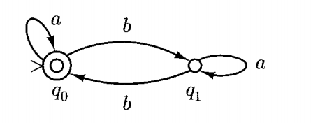
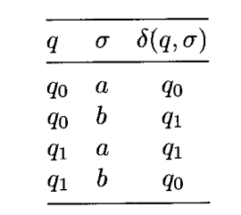
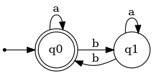
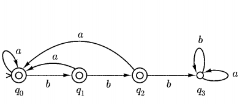

# 确定性自动机(Deterministic finite automata)

为了解决上一章留下的问题，我们设想了这样一个机器，当他遇到一个字符串时，按顺序读取字符串，根据字符串的内容作出一定的反应，最后根据读完字符串后**机器停留的状态**决定该字符串是否属于某一Regular Expression。

## 基本定义

根据以上需求，我们将其书面化，得到一个DFA必须包含的要素：
$M=(K,\sum,\delta,s,F)$

* $K$:一系列状态的集合
* $\sum$:alphabets
* $s$:初始状态
* $F$:$F\subseteq K$,最终状态（如果string符合该Regular Expression，则最后停止于最终状态）
* $\delta$:转义函数，根据当前状态和输入字母得到下一个状态，$K \times \sum \rightarrow K$

## 示例

上图是一个图灵机，其中最左侧有一个向右箭头表示为初始状态，而$q_0$有2个圆圈表示其为最终状态。其转移函数为

在如上图灵机中，假如输入为aabba,则其状态变化为$q_0,q_0,q_1,q_0,q_0$，最终停在$q_0$

我们把如上过程表示为

$(q_0,aabba)\vdash_M(q_0,abba)\vdash_M(q_0,bba)\vdash_M(q_1,ba)\vdash_M(q_0,a)\vdash_M(q_0,e)$
($e$为空字符串)

!!! note "$\vdash^M$ 定义"
    $(q,aw)\vdash^M (q',w)$ if and only if $\delta(q,a)=q'$

其中$\vdash_M$，代表FDA的一步移动，我们也可以用$\vdash^*_M$表示**0**到多步移动

在之后的笔记中，由于笔者画图水平的限制x，也会用以下图例来表达图灵机，基本含义与上图相同。

## 如何用FDA表达一个regular expression

以下是一个例子，如何用FDA识别一个包含3个连续的b的字符串（alphabet为{a,b}）

1. 首先确定初始状态为$q_0$，当输入3个b之后进入$final\ state\ q3$，给中间过程（即输入一个b，输入两个b）分别定义状态，并确定了当输入b时的状态转移。
2. 当进入$F$后，该字符串已经包含3个连续的b，此时后续输入不应该影响状态，所以其进入$trap\ state$（无论输入如何，均留在该状态）
3. 在中间状态时，如果输入a，即代表字符串中连续的b断了，此时应该回到初始状态$q_0$

!!! note
    一个DFA对应一种regular language，即能被该DFA accept的language均属于该类regular language.

