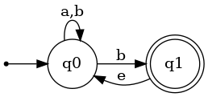

# 非确定性自动机(Non-deterministic Finite Automata)

## 基本定义

以下两图展示了两种NFA相对于DFA的特殊性质。

* 在同一个状态同一个输入后，也可以跳转到不同的状态
* 即使输入是空，也可以跳转到不同的状态

那字符串输入图灵机后会发生什么呢，我们有两种理解方式:

* 字符串会尝试NFA中转移的每一个可能性，形成一个树状结构，在最后，只要有一种可能性落在了NFA的finial state中，即属于该NFA表达的regular language。
* 每次一个字符输入NFA，NFA总会选择最优的分支，如果该字符串输入该NFA表达的regular language，那么最终的状态一定会属于final state

容易知道以上两种表达方式是相同的。

## 公式化定义

NFA可由5个要素表达：$\{K,\sum,\Delta,s,F\}$,与DFA唯一的区别是$\Delta$:

$\Delta=K\times(\sum\cup\{e\})\times K$

与之前的区别就是$\delta$是一个函数，一对state和input只能得到一个值，而$\Delta$是一个集合，一对state和input能得到多个值，而且input可以为空。

与DFA相同有$\vdash^M的定义，此处不重复$

NFA的设计会简单很多，因为总能猜对，只要我们能保证：

* 当input属于regular language时候，总有路走对。
* 当input不属于的时候，没有路能走对。

## NFA和DFA等价性

> 任意一台NFA均有和他等价的DFA

对于任意一NFA，如果我们把它的状态的集合看成一个状态，那由于每次输入一个字符，一个状态能跳转到的状态终究是属于该NFA状态的集合，所有我们可以用状态的集合组成的状态来描述NFA的跳转，此时的跳转是确定的。

### 例子

我们将用如下例子来说明一个DFA是如何转化为NFA的

=== "NFA"
    

=== "DFA 状态"
    将NFA中的可能状态的集合作为DFA的可能状态，得状态如下：

    $\{q_0\},\{q_0,q_1\},\{q_1\},\emptyset$
    
    以上是DFA的可能状态，其中，初始状态与NFA相同，为$\{q_0\}$，最终状态为包含NFA中最终状态的集合，为$\{q_0,q_1\},\{q_1\}$
    
=== "DFA 构造"
    

    NFA中$q_0$输入a后只会跳转到$q_0$，而$q_0$输入b后有可能跳转到$\{q_0,q_1\}$
    
    对于$q_1$来说，无论a还是b,路都是断掉的，所以输入a,b后，进入空集状态，对于空集状态亦如此。
    
    对于$\{q_0,q_1\}$，读a之后有可能出现的集合只有$q_0$（$q_1$读入a无之后状态，$q_0$读入a进入$q_0$），读入b之后有可能去到的状态还是$\{q_0,q_1\}$，得下图。

    

=== "最终结果"
    由于初始状态为$q_0$，所以有些状态无法到达，删掉这些状态，得到最终结果
    

（画图真的好烂啊我x）

### 公式化表达
我们定义一个$E(q)$具有如下性质

* $q\in E(q)$
* $if (p,e,r) \in \Delta,r\in E(q)$

我把它叫做q的等价状态集（因为他们之间的转移无需输入任何字符）

那么对于一个NFA $M=\{K,\sum,\Delta,s,F\}$，我们可以找到一个DFA $M'=\{K',\sum,\delta',s',F'\}$，其中：

* $K'=2^K$ (即用NFA中状态的集合作状态)
* $s'=E(s)$ （即所有s的等价状态）
* $F'=\{Q\subseteq K : Q \cup F \neq \emptyset \}$ （即任何包含NFA中final state的状态）
* $\delta'(Q,a) = \bigcup \{ E(p): p \in K\ and\ (q,a,p)\in\Delta\ for\ some\ q \in Q \}$(即Q中的状态所能到达所有的状态和他们的等价状态组成的集合)