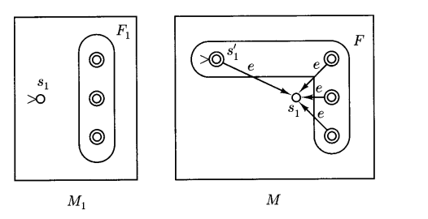

# regular language

## language操作对正则性质的影响

我们之前学习了language的拼接，重复，合并等操作，那两种regular language经过上述o操作后还能保持其正则性质吗？

因为regular language和finite automata一一对应，所以，我们只要能够构造出能够接收复合后language的finite automata,就能够证明其正则性保持不变。

### union

union与或操作类似，对于字符串$a\cup b$，$M_1$能处理a，$M_2$能处理b，我们只需要判断该字符串属于a还是b，即可以将字符串送到对应的automata中处理，而NFA刚好有“选择最优跳转路径”的特性，因此我们构造automata如下：

可发现union不改变正则性

### concatenation

拼接操作下，与上文相同，对于字符串$ab$，我们只需要在字符串a被$M_1$识别完之后跳转到$M_2$，即在$M_1$final state接条空字符串跳转到$M_2$的initial state就可以构造识别$ab$的NFA了，至于什么时候跳转，伟大的NFA会解决这一切的。

可发现concatenation不改变正则性

### Kleene star(重复)

重复字符串与拼接字符串差不多（可看成相同字符串的拼接），因此对于$a^*$，我们可以将$M_1$的final state全部接一条空字符串跳转回去initial state，即可完成。

了吗？事实上不然，因为Kleene star包括等于0的情况，而以上方法无法识别空字符串，因此我们采用如下方法，新造一个initial state，具体如下图：

可发现Kleene star不改变正则性。

### complementation(补集)
设一个语言为$L$,则其补集为$\overline L$，其含义是，对于该alphabet上的所有字符串，如果不属于$L$，则属于$\overline{L}$，那么其判定方法也很简单，用和$L$一样的finite automata，将其中的非final state变成normal state，即可修改成接收$\overline{L}$的图灵机了。

!!! note
    拼接，重复和合并均不改变语言的正则性。

## regular expression 和 finite automata的互相转化

### regular expression 转 finite automata
以上三者为regular expression构造的三种常用手段基于以上三种方法，我们可以总结出通过regular expression构造finite automata的方法：
  
* 对于单个字符，直接构造,如下图：

* 对于拼接操作，直接拼接两个automata（中间加不加空字符串转移都行）

* 对于并集，加一个initial state然后空字符串分支，如下图：

* 对于Kleene star，我们进行如下操作（注意finite state的位置）:
  

基于以上操作，我们几乎可以把任何regular expression转化成finite automata了。

### DFA 转 regular expresssion

对于一个DFA，我们可以通过如下手段把其转化为regular expression，关键词是缩边。步骤如下：

* 选择一个非起始或最终状 态（中间状态），将其删去，然后修改所有其关联的边，具体操作方法如下图所示：

* 重复上述步骤，直到只剩下起始状态和最终状态为止，最后剩下那条边（如果有多个最终状态即用union连接）就是regular expression。范例如下：

!!! info
    事实上，中间删结点的顺序是不固定的，先删哪个都行，**但是注意删节点的时候要通盘考虑不能有遗漏的地方**

## 非Regular Language证明——pumping theroem

不是所有的Language都可以用regular expression表示的，就算他本身有规律。

!!! Tip
    0和1数量相等的01字符串就不属于regular expression，这种需要计数的规律**一般意义上**不能用有限的状态来表示，但是这仅仅是个口语表述。

为了判定一个属不属于regular expression，我们提出了以下理论：

!!! Note "Pumping Therom"
    对任意一个regular language $L$，存在一个正整数n，使得对于任意一个string $\omega\in L$,$|\omega|\geq n$,他可以被写成$xyz$，满足如下性质:

    * $y\neq e$
    * $|xy|\leq n$
    * 对于任意$i\geq 0$，$xy^iz\in L$

这个理论看起来特别复杂，起始很简单，它基于两个基本的事实：

* regular language本身的长度是任意长的，但是FA的状态个数是有限的。
* 鸽笼原理（只要输入FA的language的字符个数大于状态数，那么必然在处理过程中的某两个字符处，FA处于同一状态）。
  
基于以上两个事实，我们令FA的状态数为n-1，对任意长度大于等于n的字符串$a_0a_1...a_i...a_j...a_n$，设a_i，a_j处FA的状态相同，则字符串$a_0a_1...(a_i...a_j)^*...a_n$最终停下来的状态与原字符串相同，即也能被accept。

上面其他三点约束都是为了让这个定理更tight一点，事实上思考一下就能得出为什么这样限制了。

符合泵定理是regular language的必要不充分条件，所以如果我们能证一个字符串不符合泵定理，即构造一个长度大于n的字符串，使得其无法被拆成如上形式，那么我们就能证明该规律非regular language.

!!! example
    证明0和1数量相等的01字符串就不属于regular expression:
    ??? answer
        对于任意一个n，构造字符串0000...00011111...111(0和1数量相同，都为n个)，该字符串前n个字符为0000...000(包含xy)，也就是说y应该也是0..000的形式，可是任意$xy^iz,y\geq 2$都会破坏0和1相等这一特征，也就是说其并不符合泵定理，非regular expression.