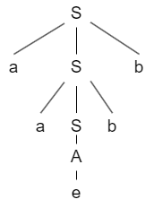
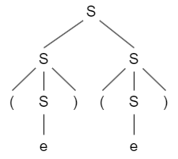
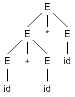
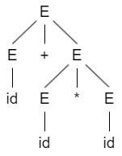

# Context-free Language(CFL)

既然regular language的表达能力是有限的，有没有其他不同的表达方法，能够表达更丰富的language表达方式呢？

!!! tip
    事实上，学过之前的regular language之后，可以在这里找到很多组概念的对应关系。

    | Context-free Language   | Regular Language   |
    | ----------------------- | ------------------ |
    | Context-free Grammar    | Regular Expression |
    | Pushdown Automata       | Finite Automata    |
    | Pumping Theorem for CFL | Pumping Theorem    |

## Context-free Grammar

Context-free Grammar 描述的是一种递推的字符串生成方式

!!! example "一种CFG"
    * $S\rightarrow aSb$
    * $S\rightarrow A$
    * $S\rightarrow c$
    * $A\rightarrow e$
    
    基于以上规则的一种字符生成方式如下：

    $S\Rightarrow aSb\Rightarrow aaSbb\Rightarrow aaAbb\Rightarrow aabb$
以上每一行称作一根条规则(rule),rule由一下三种字符组成:

* non-terminal: S,A
* start symbol: S
* terminal: a,b,c

!!! attention
    * 字符串的生成首先从start symbol开始
    * non-terminal 只是一种“中间符号”，最后生成的字符串里面是要消失掉的。
    * 每一条规则的箭头左侧只能有一个non-terminal。

其严格定义如下：

!!! note
    一个CFG由如下几种要素组成 $G=(V,\sum,S,R)$

    * V : 有限个symbols的集合
    * $\sum$ : 终止符(terminals)的集合，即$V-\sum$为非终止符
    * $S$ : 起始符，$S\in V-\sum$
    * $R$ : $R\subseteq (V-\sum)\times V^*$ 有限个规则的集合
  
    与Regular Language中的$\vdash$操作相同，在此处，我们有：
    
    $xAy\Rightarrow xuy$表示一步推导(Derive in one step)

    $xAy\Rightarrow^* xuy$表示多步推导（包括0步）

## Context-free Language

由某种CFG生成的language为Context-free Language.

## Parsing tree

事实上，CFG生成string的过程，可以由树状结构来表示，比如上面给出的字符串生成例子的解析树如下：

解析树这个概念被提出的意义在于，在用CFG生成字符串的时候，对于同一个结果字符串，存在不同顺序的生成方式，比如对于如下CFG:

* $S \rightarrow e$
* $S \rightarrow SS$
* $S \rightarrow (S)$

要生成字符串:()()，可以有如下两种方式:

*$S\Rightarrow SS \Rightarrow (S)S \Rightarrow (S)(S) \Rightarrow (S)() \Rightarrow ()()$
*$S\Rightarrow SS \Rightarrow S(S) \Rightarrow (S)(S) \Rightarrow ()(S) \Rightarrow ()()$

但对于以上两种方法，我们将他们的解析树画出来，可以发现都是一样的。

由此可以发现，以上两种生成方式可以理解为只是对该树两种不同顺序的“遍历”，其本身并无实质区别。

因此，解析树能够帮助我们从一个更加统一和规范的角度理解“派生”这种过程。并且我们将解析树相同的派生方式叫做`equivalence alsses of derivations`

基于此，课本上还定义了最左派生(leftmost derivation)，最右派生(rightmost derivation)，和不同派生方法间的偏序关系，但是这些部分myc上课没讲只是一些概念，所以此处略过，有空再补。

### ambiguity

事实上，对于某些CFG来说两种派生方式生成的解析树也有可能不同。比如如下CFG:

* $E \rightarrow E+E$
* $E \rightarrow E*E$
* $E \rightarrow (E)$
* $E \rightarrow id$

要生成字符串 id + id * id，有如下两种parsing tree.

  

这种ambiguity是CFG导致的，事实上，我们可以通过将CFG复杂化，改变成如下形式：

* $E \rightarrow E+T$
* $E \rightarrow T$
* $T \rightarrow T*F$
* $T \rightarrow F$
* $F \rightarrow id$

就可以消除ambiguity。

!!! danger ""
    除了以上由grammar导致的ambiguity，还有由于语言本身特征导致的ambiguity，我们称之为 **inherently ambiguous**，无论用什么CFG去生成他们都会导致ambiguity，具体例子之后补，此处仅做了解。

## Chomsky Normal Form(乔姆斯基范式，CNF)
CFG生成的规则多种多样，但是我们可以定义一种grammar范式，作为基础:

!!! note
    如果一个CFG符合CNF，那么它每条规则应该符合如下三种形式之一：

    1. $S \rightarrow e$
    2. $A \rightarrow BC$，A可为初始状态，BC不可为初始状态。
    3. $A \rightarrow a,a \in \sum$ 
CNF有如下特性
!!! Theorem
    * 假如一条长度为n的字符串由CNF生成，那它必然会经过2n-1次派生（n-1次用来增加长度，n次将中间符替换为最终符）
    * 任意CFG都可以化成CNF的形式。
  
定理二较为复杂，具体来说，CFG违反CNF的可能如下：

* $S$ 出现在推导规则右侧
* $A\rightarrow e\ A\neq S$
* $A\rightarrow B\ B\in V-\sum$
* $A\rightarrow u_1u_2u_3...u_k\ k\geq 3$
* $A\rightarrow u_1u_2$ ,$u_1$或$u_2$不为中间符号

我们在修正过程中，可以从上到下依次修正，并且在修改某一违反情况时，**对于后面违反规则的修正不可以属于前面的规则，对于前面违反规则的修正可以属于后面的规则**

可以通过如下例子说明修正过程。

!!! example
    CFG:

    * $S\rightarrow ASA|aB$
    * $A\rightarrow B|S$
    * $A\rightarrow b|e$
  
    step I: 修正$A\rightarrow S$，我们可以新定义一个开始字符$S_0$和规则$S_0\rightarrow S$，避免该情况发生。

    * $S_0\rightarrow S$
    * $S\rightarrow ASA|aB$
    * $A\rightarrow B|S$
    * $B\rightarrow b|e$

    step II: 修正$B\rightarrow e$类错误，我们可以删去这条路，然后补一条路在其上游节点(A，S)。

    * $S_0\rightarrow S$
    * $S\rightarrow ASA|aB|ae$
    * $A\rightarrow B|S|e$
    * $B\rightarrow b$

    然后继续修正$A\rightarrow e$。

    * $S_0\rightarrow S$
    * $S\rightarrow ASA|aB|ae|AS|SA|S$
    * $A\rightarrow B|S$
    * $B\rightarrow b$

    第二条删去没意义的，修正为$S\rightarrow ASA|aB|a|AS|SA$

    接着处理违反规则3，与违反规则2的处理方式相同，删去该边，然后补上游节点。

    处理$S_0\rightarrow S$

    * $S_0\rightarrow ASA|aB|a|AS|SA$
    * $S\rightarrow ASA|aB|a|AS|SA$
    * $A\rightarrow B|S$
    * $B\rightarrow b$
    
    处理$A\rightarrow B$,$A\rightarrow S$

    * $S_0\rightarrow ASA|aB|a|AS|SA$
    * $S\rightarrow ASA|aB|a|AS|SA$
    * $A\rightarrow ASA|aB|a|AS|SA|b$
    * $B\rightarrow b$
    
    处理规则四，对于生成个数大于3的部分，如$S_0\rightarrow ASA$等，采用如下方式处理：
    
    定义$U\rightarrow SA$,则$S_0 \rightarrow UA$

    如果箭头右边中间符号个数，按如上方式递归处理，

    处理规则五，对箭头右边既有终止符又有中间符号的部分，如$A\rightarrow aB$可以通过如下方式处理：

    $V\rightarrow a$，$A\rightarrow VB$

    通过这几步一路处理下来，就满足CNF了！！！